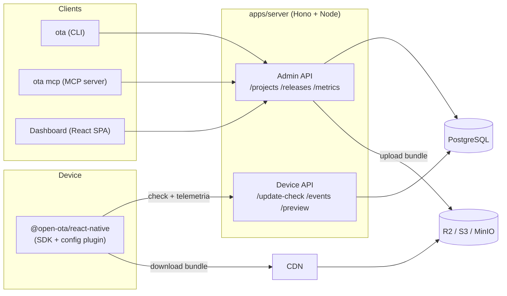

# Open OTA

> Nome provisório. CLI = `ota`, packages = `@open-ota/*`. Renomear é trivial nesta fase.

Plataforma self-hosted de OTA updates (Over-the-Air) para React Native/Expo: publica atualizações de JS/assets sem passar pela App Store/Play Store, com **observabilidade, rollout gradual, rollback automático, assinatura criptográfica e administração** — o que o CodePush/App Center tinha e o [hot-updater](https://github.com/gronxb/hot-updater) não tem.

## Por que existe

| Solução | Situação |
|---|---|
| CodePush / App Center | Aposentado em 31/03/2025. Era a referência em métricas (active users por release, rollout %, promote, rollback automático). |
| EAS Update (Expo) | Excelente protocolo, mas hospedado/pago, fechado, e insights de adoção limitados. |
| hot-updater | Melhor opção self-hosted atual. Ótimo mecanismo de update (fingerprint, channels, rollback local, diffing), mas **sem telemetria, sem dashboard de adoção, sem rollout %, sem code signing, sem API de administração**. |

Open OTA pega o mecanismo do hot-updater + o protocolo/conceitos do Expo Updates + o modelo operacional do CodePush, numa stack única e simples.

## Princípios

1. **Provider-agnóstico, Supabase first-class** — um codebase (Hono) com três deploy targets: **Supabase** (Edge Function + Postgres + Storage, provisionado em um comando via CLI/MCP deles), **Cloudflare** (Workers + D1/R2) e **Docker self-host** (`docker compose up`). Duas costuras isolam o provider: db adapter (dialetos pg/sqlite) e storage adapter. O mesmo codebase roda o **serviço hospedado (SaaS)** com `OTA_MODE=hosted`: multi-tenant, signup self-serve, Stripe.
2. **Uma API para tudo** — dashboard, CLI e MCP server são clientes finos da mesma Admin API. Zero lógica duplicada entre providers ou clientes.
3. **Seguro por padrão** — toda release é assinada (RSA-2048) e verificada no device antes de executar. CDN/storage comprometido não injeta código.
4. **Telemetria barata** — contadores agregados + 1 linha por device. Nunca 1 linha por evento. Funciona igual com 10 mil ou 1 milhão de instalações.
5. **Agent-first** — MCP com tools únicas em dois transportes: remoto Streamable HTTP em `/mcp` com OAuth 2.1 ("conectar e funcionar", zero instalação — o cartão de visita do hosted) e stdio local (`ota mcp`). Claude/Cursor administram a plataforma com linguagem natural.

## Componentes



## Monorepo (proposto)

```
open-ota/
├── apps/
│   ├── server/          # Hono: Device API + Admin API — buildado p/ Node, Supabase Edge (Deno) e CF Workers
│   └── dashboard/       # React SPA (Vite) — estática: servida pelo server, via `ota console`, ou deploy próprio
├── packages/
│   ├── react-native/    # SDK (Expo Modules API) + Expo config plugin
│   ├── cli/             # ota — inclui `ota mcp` (MCP server embutido)
│   └── shared/          # tipos, client da Admin API, canonical JSON, assinatura
└── docs/
```

## Documentação

| Doc | Conteúdo |
|---|---|
| [docs/ARCHITECTURE.md](docs/ARCHITECTURE.md) | Análise do hot-updater/Expo/CodePush, arquitetura, decisões de stack com trade-offs, fluxos (publish, update, rollback, preview QR), SDK internals, escala |
| [docs/DATA-MODEL.md](docs/DATA-MODEL.md) | Modelo de dados, mapeamento das entidades, estratégia de telemetria barata, queries do dashboard, retenção |
| [docs/API.md](docs/API.md) | Protocolo SDK↔servidor, endpoints, modelo de segurança/assinatura, deep link tokens, threat model |
| [docs/BUILD-PLAN.md](docs/BUILD-PLAN.md) | Escopo v1 completo (sem MVP), ordem de construção por dependência, riscos e matriz de validação |

## Cobertura dos requisitos

| # | Requisito | Onde |
|---|---|---|
| 1 | Análise hot-updater / Expo Updates / CodePush | ARCHITECTURE §1 |
| 2 | O que reutilizar como conceito | ARCHITECTURE §1.4 |
| 3 | Arquitetura completa | ARCHITECTURE §2–3 |
| 4 | Componentes principais | ARCHITECTURE §3 |
| 5 | Fluxo de publicação e instalação | ARCHITECTURE §4.1–4.2 |
| 6 | Fluxo de rollback | ARCHITECTURE §4.3 |
| 7 | Fluxo QR Code / deep link | ARCHITECTURE §4.4 |
| 8 | Modelo de banco de dados | DATA-MODEL |
| 9 | Endpoints principais da API | API §2–3 |
| 10 | Protocolo SDK↔backend | API §2 |
| 11 | Segurança e assinatura | API §4 |
| 12 | Usuários ativos por versão sem custo excessivo | DATA-MODEL §4 |
| 13 | Estrutura do MCP Server | ARCHITECTURE §3.5 |
| 14 | Estrutura da CLI | ARCHITECTURE §3.4 |
| 15 | Estratégia de entrega | BUILD-PLAN — sem MVP por decisão: escopo completo de uma vez, ordenado por risco |
| 16 | Escopo v1 vs extensões futuras | BUILD-PLAN §1 |

> Docs em PT-BR nesta fase de validação. Se o projeto virar open source, README/docs públicas migram para EN.

**Status**: design fechado — todas as decisões validadas em 2026-09-01 (Hono+Drizzle · SPA estática · Project≡App · RSA-2048 · autoconfig Expo+bare · rollback em 1 crash · upload direto ao storage · providers Supabase+Cloudflare+Docker no v1 · sem MVP · nome open-ota · Old+New Architecture · auth Bearer-only · licença MIT · ambiente de devices pronto · **modo hosted multi-tenant com Stripe completo no v1** · **signup aberto com e-mail verificado** · **MCP remoto `/mcp` com OAuth 2.1**). npm verificado: `open-ota` e escopo `@open-ota` livres. Próximo passo: construir, na ordem do BUILD-PLAN.
