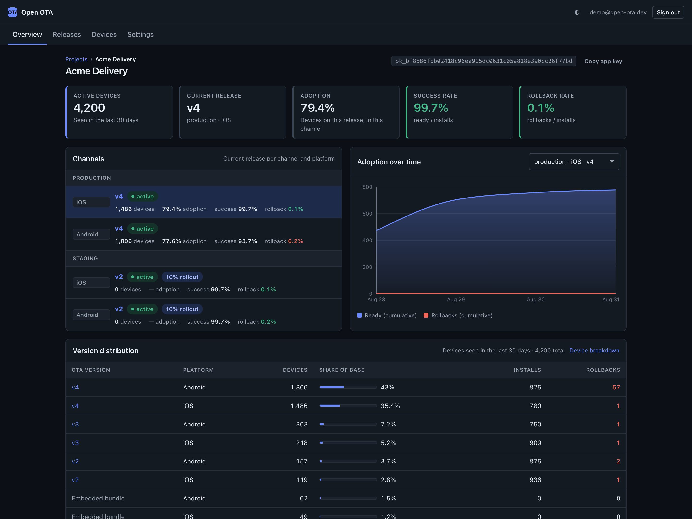
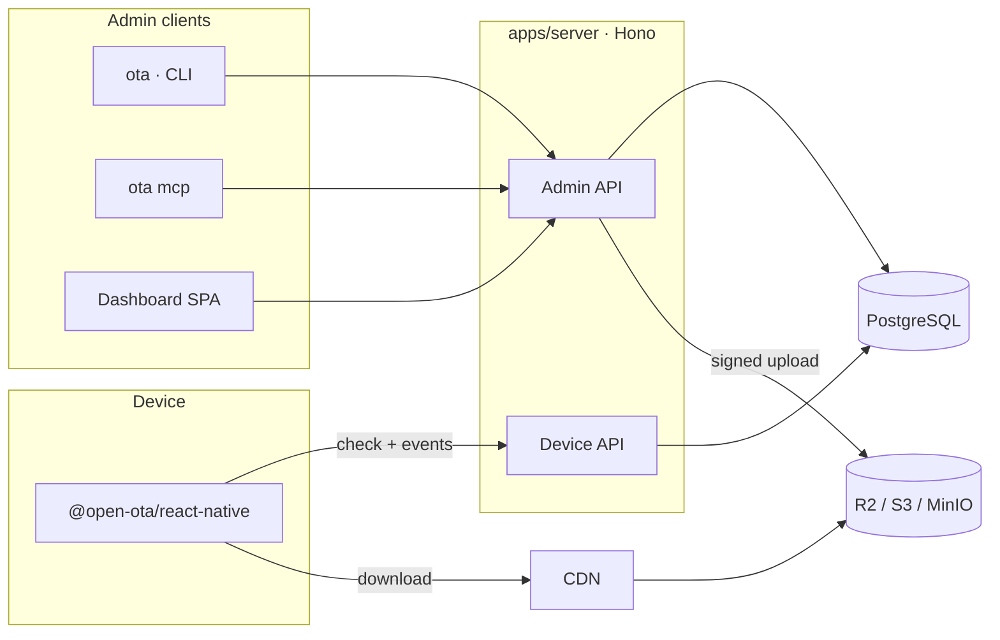
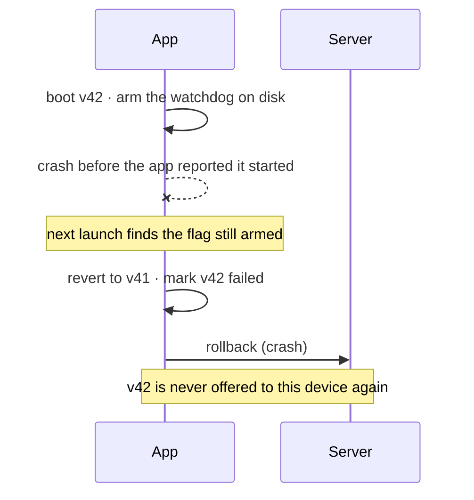
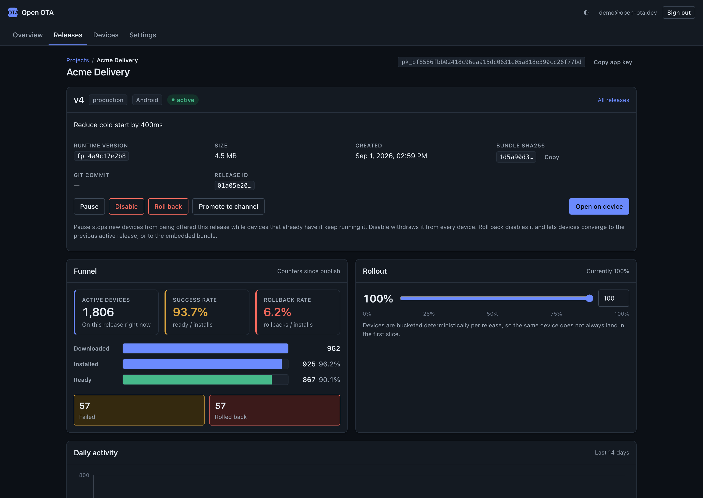
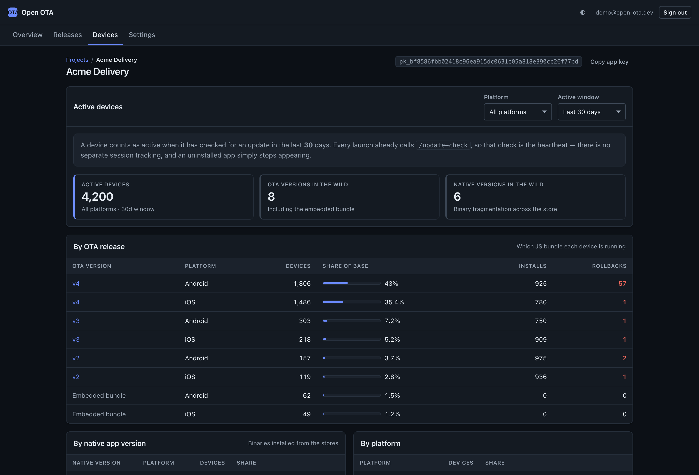
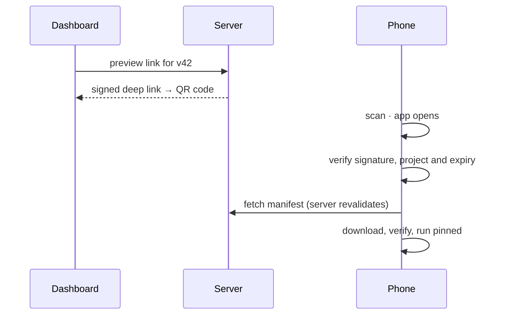

<div align="center">

# Open OTA

**Self-hosted over-the-air updates for React Native and Expo.**

Ship JavaScript and asset changes without an App Store or Play Store review — and see exactly what happens next.

[](LICENSE)
[](https://github.com/dnlsilva/open-ota/actions/workflows/ci.yml)


[open-ota.dev](https://open-ota.dev) · [Quick start](#quick-start) · [Architecture](#architecture) · [MCP](#drive-it-from-an-agent) · [Docs](https://open-ota.dev/getting-started/introduction/) · [Issues](https://github.com/dnlsilva/open-ota/issues)

</div>

---



---

```bash
ota publish --channel production --rollout 10
```

```
v42  android  production   rollout 10%   4.8 MB   b94d27b9…
     8,250 devices · 82.5% of base · 99.6% ready · 0.4% rollback
```

Every release is signed. Every device verifies it before a byte runs. Every rollout is a number you control and a number you can read.

## Features

- **Signed releases** — a per-project RSA key pair; the device verifies the manifest signature and the bundle digest before extracting anything.
- **Automatic rollback** — a release that crashes before the app reports it started is reverted on the next launch and never offered to that device again.
- **Gradual rollout** — deterministic, stateless bucketing. Raising a percentage only ever adds devices.
- **Adoption metrics** — active devices per OTA release *and* per native app version, funnel, rollback rate, adoption over time.
- **Channels and promotion** — development, staging, production, or your own; promote a release between them without rebuilding or re-uploading.
- **Native compatibility enforced structurally** — fingerprint plus a build floor, so an update cannot land on a binary that cannot run it.
- **Open a release on a real phone** — signed deep link as a QR code, pinned, without touching the global rollout.
- **Remote and local MCP** — connect an agent with one command and publish, roll out and read metrics in natural language.
- **Multi-tenant when you want it** — one flag turns on organisations, plans, quotas and Stripe.
- **iOS and Android, old and new React Native architecture**, Expo and bare projects alike.

## Architecture

One codebase, one Postgres schema, three deploy targets. The dashboard, the CLI and the MCP server are thin clients of the same Admin API — nothing is implemented twice.



Bundles never pass through the API. The CLI hashes locally, asks for a signed upload target, and writes straight to the bucket — which is what lets the same server run inside an edge function, and keeps a 50 MB publish off your API's critical path.

## Quick start

```bash
docker compose up -d     # server + postgres + minio
npx @open-ota/cli login
npx @open-ota/cli init   # links the project and wires the native side
npx @open-ota/cli publish -c staging --rollout 10
```

In the app:

```tsx
import { OpenOta, OtaProvider } from "@open-ota/react-native";

export default OpenOta.wrap(function App() {
  return <OtaProvider>{/* your app */}</OtaProvider>;
});
```

That is the whole integration. The config plugin (Expo) or `ota init` (bare React Native) handles the native wiring, the deep link scheme and the embedded public key — including both the bridge and bridgeless boot paths.

Want to see it before wiring anything up?

```bash
pnpm --filter @open-ota/server demo     # a full server on an in-process Postgres, pre-seeded
pnpm --filter @open-ota/dashboard dev   # the screenshots above, on your machine
```

## How updates work

### Signed, verified on the device

Each project gets its own RSA key pair. The private half never leaves the server, sealed at rest; the public half is baked into your binary. The device verifies the signature over the manifest, checks the bundle digest, and only then extracts and runs it. A compromised CDN cannot inject code — the worst it can do is serve bytes that fail the hash.

The bundle URL sits deliberately **outside** the signed manifest. It is transport: move CDNs, change domains, put a cache in front, and every existing release stays valid.

### Automatic rollback, on one strike



The watchdog flag is written to disk **before** React Native is handed the bundle — so a crash during the very first frame cannot look like a clean launch next time. One failure is enough to revert.

Rollback also works from the other direction: disable a release in the dashboard and every device converges off it on its next check, back to the previous release or to the bundle inside the binary.



### Gradual rollout you can reason about

```
bucket = sha256(deviceId + ":" + releaseId) % 10000
offered when bucket < rolloutPercent * 100
```

Deterministic, stateless, salted per release. No release×device table to grow. Raising a percentage only ever *adds* devices — nobody is pulled off a build they already installed. Salting by release means a device that got the last canary is not automatically in the next one.

### Adoption at a cost that does not grow



The update check **is** the heartbeat, so measuring active users needs no extra request. Each installation is one row, written at most hourly and only when something changed; the funnel lives in daily counters per release. Cost is O(devices) + O(releases × days), never O(events). At 100k devices that is a handful of writes per second, and a million devices is the same shape ten times over.

### An update can never reach an incompatible binary

A release is pinned to the fingerprint of the native project it was built against, and to a floor id stamped into the binary at build time. Change a native dependency and the fingerprint changes, so old releases stop being offered to that build automatically. Ship a new binary and it will never accept a bundle older than the JavaScript inside it. Structural, not a convention someone has to remember.

### Open a specific release on a real phone



Hand a QA engineer a QR code and they are running that exact build in seconds — pinned, and reversible with one call. Knowing a release id is not enough to install it: the link carries a payload signed with the project's own key, scoped to one project and one release, and it expires.

## Run it where you want

| Target | Runtime | Database | Storage | Provision |
|---|---|---|---|---|
| **Supabase** | Edge Function | Supabase Postgres | Supabase Storage | `ota init --provider supabase` |
| **Cloudflare** | Workers | Postgres via Hyperdrive | R2 | `ota init --provider cloudflare` |
| **Docker** | Node | Postgres | MinIO / S3 / R2 | `docker compose up` |

Storage is an adapter with three implementations — S3-compatible (R2, S3, MinIO), Supabase Storage, and local disk for development. Put any CDN in front; bundles are immutable, so they cache forever.

`OTA_MODE=hosted` turns on multi-tenancy, signup, plans, quotas and Stripe if you want to run it as a service. The default single-organisation mode has no billing and no metering at all.

Per-target details: [apps/server/README.md](apps/server/README.md).

## Drive it from an agent

```bash
claude mcp add --transport http ota https://your-server/mcp
```

Browser opens, you sign in, done — nothing to install, no token to paste. Any MCP client connects the same way: OAuth 2.1 with PKCE and dynamic client registration, so the client registers itself. Then ask for what you want:

> *"Publish the current build to staging."*
> *"What percentage is still on v41?"*
> *"Is v52 rolling back more than the one before it?"*
> *"Roll v53 out to 10%."*

Fifteen tools covering publish, promote, pause, rollback, rollout, metrics, distribution and QR generation. The contract lives in one place and both transports — remote HTTP and local stdio (`ota mcp`) — bind to it, with a conformance test that fails if they ever drift apart. A release is named the way a person says it: `v42` works anywhere a UUID does.

## CLI

```
ota login                  ota releases              ota rollout <release> <pct>
ota init [--provider]      ota release <v42|id>      ota pause|resume|disable
ota fingerprint [--check]  ota promote <rel> <chan>  ota rollback
ota publish                ota metrics               ota preview <release>   # QR in the terminal
ota doctor                 ota console               ota mcp
```

`ota doctor` checks every assumption the SDK makes at runtime — config, connectivity, native wiring, fingerprint drift, conflicting update libraries — and tells you which one failed.

## Repository

```
apps/server            Hono: Device API + Admin API + MCP endpoint. Node, Deno and Workers
apps/dashboard         React SPA — releases, rollout control, adoption, device distribution
packages/react-native  SDK (Expo Modules, Kotlin + Swift) + config plugin + bare RN codemods
packages/cli           ota — publish, promote, rollout, rollback, metrics, preview, doctor, mcp
packages/shared        the contract: protocol, canonical JSON, signing, bucketing, API client
examples/expo-demo     end-to-end harness
```

```bash
pnpm install && pnpm typecheck && pnpm test
```

## Documentation

| Doc | Contents |
|---|---|
| [docs/ARCHITECTURE.md](docs/ARCHITECTURE.md) | The architecture, stack decisions with their trade-offs, and the publish, update, rollback and preview flows |
| [docs/API.md](docs/API.md) | The SDK↔server protocol, the admin endpoints, and the security and signing model |
| [docs/DATA-MODEL.md](docs/DATA-MODEL.md) | Schema, entity mapping, and the cheap-telemetry strategy |
| [docs/BUILD-PLAN.md](docs/BUILD-PLAN.md) | Scope, build order, risks and the validation matrix |
| [apps/server/README.md](apps/server/README.md) | Running the server on each deploy target |

Design documents are in Portuguese; code, comments and this README are in English.

## Status

Pre-release. The server, SDK, CLI, dashboard and MCP endpoint are implemented and covered by 198 tests, including a suite that runs the real migrations against a real Postgres engine in-process — so the spine of the product can be checked without Docker.

What has not happened yet is the part only hardware can settle: **nothing here has run on a phone.**

<details>
<summary><b>Known limitations</b></summary>

1. **Asset resolution is unverified — the open question.** A release is the `expo export` output zipped as-is, and the native side finds the bundle through `metadata.json`. Whether React Native then resolves `require`d images from an updated bundle still has to be measured on a device. JavaScript-only changes should be fine; adding or changing an image may not be. Do not flatten the archive to "fix" this without measuring first — `metadata.json` is the only thing mapping a hashed file back to what the bundle asks for.
2. **The Android reload path swaps the bundle by reflection**, because neither `ReactInstanceManager` nor `ReactHost` re-reads the path on reload. If the swap fails the SDK rolls back to pending and applies on the next launch rather than pretending it worked. Needs checking per React Native version.
3. **The iOS cold-start deep link** relies on the host `AppDelegate` forwarding `application(_:open:options:)` to `RCTLinkingManager`. Templates that do not can call `handlePreviewLink(url)` from JavaScript.
4. **The Docker image and the edge entries are unbuilt.** The Node path was smoke-tested against a real Postgres; the Dockerfile, Supabase Edge Function and Cloudflare Worker are typecheck- and configuration-level only.

</details>

<details>
<summary><b>Validation matrix</b></summary>

| | Old architecture | New architecture |
|---|---|---|
| Android (API 24, current) | not run | not run |
| iOS (15.1, current) | not run | not run |
| Expo prebuild | not run | not run |
| Bare React Native | not run | not run |

</details>

## License

MIT
