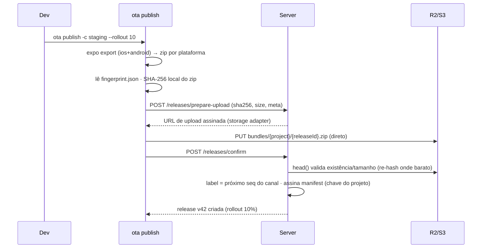
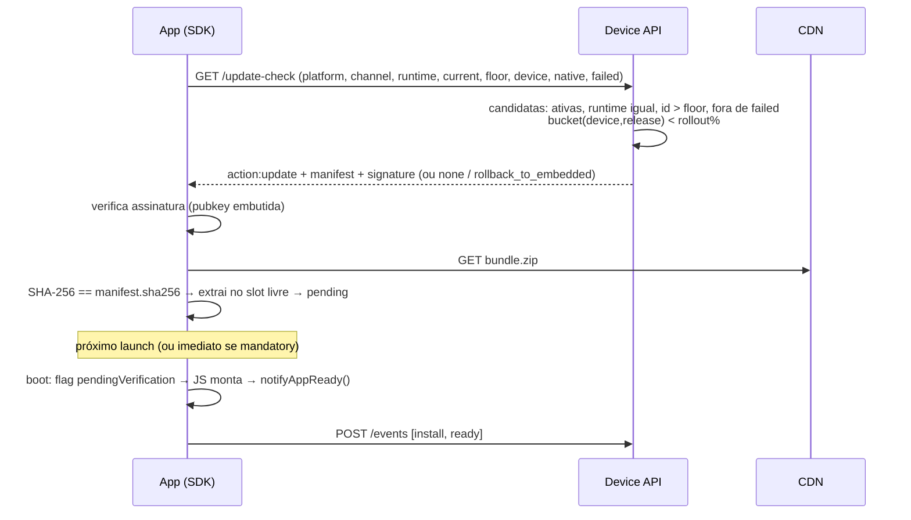
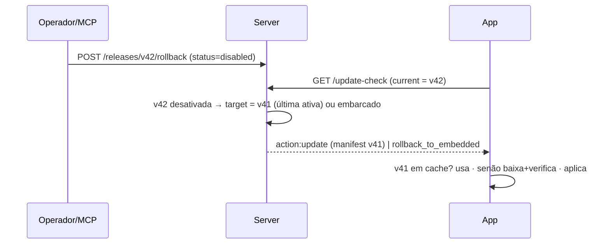
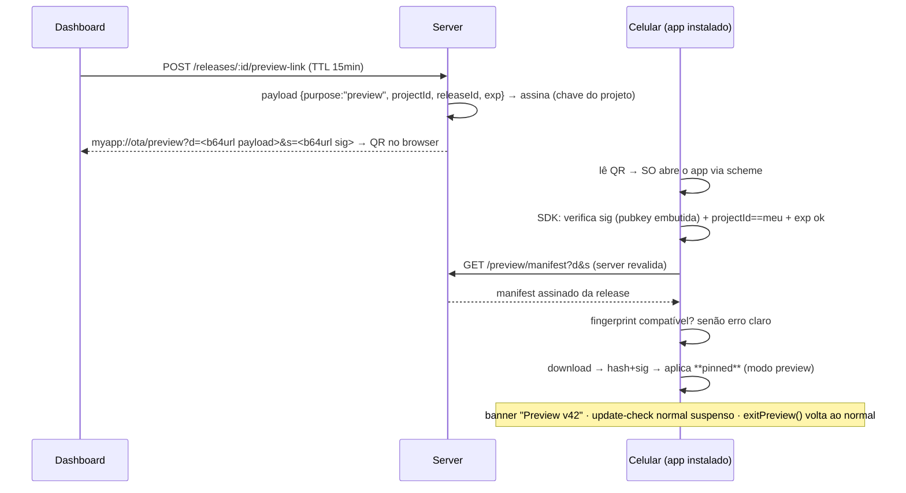

# Arquitetura

## 1. Fundamentos: de onde vêm as ideias

### 1.1 CodePush / App Center (†2025)

Modelo operacional que queremos recuperar:

- **Deployments** (Staging/Production) com chave embutida no app; `promote` copia uma release entre deployments.
- **Release**: label incremental (`v1`, `v2`…), target binário por range semver, flag `mandatory`, `rollout %` (increase-only), enable/disable.
- **`notifyApplicationReady()`**: se o app não confirma que iniciou bem após o update, o SDK reverte para o pacote anterior no próximo launch e reporta a falha. O servidor para de oferecer aquela release para aquele device. É o coração do rollback automático.
- **Métricas por contadores**: cada device reporta status (`DeploymentSucceeded`/`Failed` + label ativo); o servidor mantém contadores por release (Active, Downloaded, Installed, Failed). Barato — nunca armazenou stream de eventos por usuário.
- **Code signing opcional**: hash do conteúdo assinado em JWT; public key embutida no app.
- **Diffs** entre releases para economizar banda.

O que não pegamos daqui: compatibilidade por range semver, que depende de alguém acertar o range em toda release. Trocado por fingerprint.

### 1.2 Expo Updates / EAS Update

O protocolo mais bem projetado do ecossistema ([spec aberta](https://docs.expo.dev/technical-specs/expo-updates-1/)):

- **runtimeVersion** governa compatibilidade JS↔nativo. Política `fingerprint` (hash do projeto nativo via `@expo/fingerprint`) elimina o erro humano do range semver.
- **Manifest assinado** (code signing com certificado embutido no app); assets individuais com hash SHA-256.
- **Diretivas** do servidor: `noUpdateAvailable`, `rollBackToEmbedded` — o servidor pode mandar o app voltar ao bundle embarcado.
- **Anti-bricking**: se um update falha ao lançar, o app sobe com o último update bom ou o embarcado.
- **Channels → branches** com rollout % por canal; update groups (iOS+Android publicados juntos).

O que não pegamos daqui: o protocolo multipart com assets individuais. Controlamos os dois lados do fio, então um zip por release com um digest resolve o mesmo problema com muito menos superfície — download parcial e diffs binários são a razão para revisitar isso um dia.

### 1.3 hot-updater

Referência de mecanismo self-hosted (verificado em hot-updater.dev, 2026):

- **Bundle ID = UUIDv7** → ordenação temporal embutida no ID; `minBundleId` gerado no build impede aplicar OTA mais antigo que o binário.
- **Estratégias**: `fingerprint` (default, via @expo/fingerprint) ou `appVersion` (semver).
- **Channels**, force update, **rollback automático com verificação no primeiro launch**.
- **Bundle diffing** (.bsdiff sobre bytecode Hermes): ~10 MB → ~600 KB, com fallback para arquivo completo.
- **Plugins**: build (Metro/Re.Pack/Expo/Rock), storage (S3/R2/Supabase/Firebase), database (Postgres/D1/Firestore). Console web local.
- Boot path: o app nativo pergunta ao SDK qual bundle carregar (`getJSBundleFile()` no Android, `bundleURL` no iOS), injetado por config plugin no Expo.

O mecanismo de update aqui é sólido e é a base do nosso. O que este projeto constrói por cima é a metade operacional: telemetria e adoção, rollout gradual, promote entre canais, assinatura obrigatória, API de administração, MCP e preview por QR.

### 1.4 Conceitos herdados

Este projeto não inventou o mecanismo de OTA do zero — ele fica em cima de padrões que o ecossistema já provou. Crédito onde é devido:

| Ideia | Origem | Por que ficou |
|---|---|---|
| UUIDv7 como identidade de release + floor de build | hot-updater | A cronologia mora no próprio id: comparar contra o floor gravado no binário não precisa de coluna extra nem de relógio no device |
| Boot path via `getJSBundleFile()` / `bundleURL` injetado por config plugin | hot-updater | Único ponto onde dá pra decidir o bundle antes do JS existir |
| `runtimeVersion` = fingerprint do projeto nativo | Expo Updates | Compatibilidade vira propriedade estrutural em vez de convenção que alguém precisa lembrar |
| Diretiva de voltar ao bundle embarcado | Expo Updates | Fecha o caso "não há mais nada que este device possa rodar" |
| Manifest assinado com chave embutida no app | Expo Updates / CodePush | Integridade não depende de o storage ser confiável |
| `notifyAppReady()` + reversão em crash no primeiro launch | CodePush | O coração do rollback automático |
| Métricas por contadores, nunca stream de eventos | CodePush | É o que torna adoção por versão barata em qualquer escala |
| Rollout %, promote entre canais, mandatory, label incremental | CodePush | Modelo operacional que já provou funcionar na prática |

**O que este projeto acrescenta**: assinatura obrigatória por projeto com chave selada em repouso · telemetria de adoção com dashboard próprio · rollout determinístico e sem estado · preview de release por deep link assinado com QR · MCP em dois transportes com contrato único · um codebase que roda em Node, Deno e Workers · modo multi-tenant com billing.

---

## 2. Stack e decisões

✅ = decisão validada com Daniel em 2026-09-01. Regra geral: **um codebase, um banco lógico, um storage** — nada de fila, cache ou microserviço até a escala exigir (gatilhos na §6). Requisito transversal: **provider-agnóstico** — Supabase first-class (provisionamento em um comando, alavancando CLI/MCP deles), Cloudflare e Docker self-host, todos no escopo v1.

| Área | Escolha | Alternativas | Por quê |
|---|---|---|---|
| Backend ✅ | **Node + TypeScript + Hono** | Fastify (mais maduro), NestJS (pesado), Go (perf) | TS compartilha tipos com SDK/CLI/dashboard no monorepo. Hono roda **idêntico em Node, Deno (Supabase Edge Functions) e Cloudflare Workers** — é o que viabiliza provider-agnóstico com um codebase só. |
| ORM ✅ | **Drizzle** | Prisma (DX ótima, runtime maior) | SQL explícito (as queries de métricas importam), leve, roda em edge. |
| Banco | **Postgres nos três targets** — Supabase, self-host, e Cloudflare via **Hyperdrive** | D1 (SQLite) no Cloudflare | ⚠️ **Mudança na implementação (28/08)**: o design previa dialeto duplo pg+SQLite. Ao construir, ficou claro que manter dois dialetos (~14 tabelas, agregações com window function, matriz de teste ×2) custa caro para zero ganho de usuário hoje — Hyperdrive já dá Postgres no Worker. Um dialeto só. A camada de repositório é a única que fala Drizzle, então adicionar D1 depois não toca os serviços. |
| Cache/fila | **nenhum** | Redis | Upsert no banco aguenta a carga de telemetria projetada. Redis entra só como buffer de contadores se ingest passar de ~500 eventos/s. |
| Storage | **Storage adapter**: S3-compatível (R2 / S3 / MinIO) + **Supabase Storage** | — | Bundles imutáveis atrás de CDN. Interface mínima: `putSignedUrl / publicUrl / head`. R2 = zero egress. |
| CDN | o do provider (Cloudflare, CDN do Supabase Storage) | CloudFront | `cache-control: immutable` — release nunca muda (novo conteúdo = nova release). |
| Dashboard ✅ | **React SPA (Vite), estática** | Next.js | Confirmado. Estático = hospedável em qualquer lugar: servida pelo server no self-host, `ota console` local nos targets edge, deploy estático opcional (Pages etc.). SSR/SEO irrelevantes p/ ferramenta atrás de login. |
| Auth ✅ | **Bearer token para tudo** (validado 2026-09-01): login e-mail+senha (argon2) emite token opaco; dashboard, `ota console`, CLI e MCP usam o mesmo mecanismo | cookie de sessão p/ dashboard | Cookie quebraria o `ota console` local contra API remota (CORS/SameSite entre domínios) e duplicaria auth. Trade-off: token em localStorage é levemente pior que cookie httpOnly contra XSS — ferramenta atrás de login, aceitável. Tokens com hash no banco, escopo por projeto, revogáveis, `last_used_at`. |
| SDK nativo | **Expo Modules API** (Kotlin/Swift) | TurboModule puro, Nitro | Funciona em Expo **e** bare RN (via expo-modules-core), abstrai Old/New Arch na ponte, muito menos boilerplate. Custo: dependência de expo-modules-core em apps bare — padrão de mercado hoje. |
| Arquiteturas RN ✅ | **Old E New Architecture** | New Arch only | Decisão de Daniel: alcance máximo (apps legados). Custo assumido: **dois caminhos de injeção do boot path** — bridge (`ReactNativeHost.getJSBundleFile`) e bridgeless (`ReactHost`) — e matriz de teste maior. Alvo: RN 0.73+ / Expo SDK 50+; iOS 15.1+; Android API 24+. |
| SDK setup ✅ | **Autoconfig p/ Expo e bare RN** | Expo-first | Decisão de Daniel: paridade desde o início. Expo via config plugin; bare via codemods do `ota init` + validação do `ota doctor`. |
| Assinatura ✅ | **RSA-2048 + SHA-256, assinatura destacada sobre JSON canônico** | Ed25519 (melhor cripto), JWT | RSA verifica nativo sem dependências no iOS (SecKey) e Android (`java.security`, qualquer API level). Ed25519 exigiria BouncyCastle/Tink no Android < 33. JWT traria parser JWT nativo — dependência sem ganho. Detalhes em API §4. |
| Upload ✅ | **Direto ao storage** via URL de upload assinada; CLI calcula SHA-256; server assina o manifest | multipart via server | Edge functions não aguentam stream de ~50–200 MB. Seguro mesmo assim: assinatura protege contra adulteração **pós-publish**; quem publica já é a fronteira de confiança autenticada (API §4.2). Onde é barato (Node self-host), o server re-verifica o hash de forma oportunista. |
| Providers ✅ | **Supabase + Cloudflare + Docker self-host**, os três no v1 | escalonar | Decisão de Daniel. Supabase = onboarding de um comando (CLI/MCP). Custo real: dialeto SQLite + matriz de teste ×3. |
| Modo hosted ✅ | **Mesmo codebase roda o SaaS do Daniel**: `OTA_MODE=hosted` liga multi-tenant (orgs, signup, billing); self-host roda com org única invisível | fork/produto separado | Um código, dois modos. Multi-tenant estrutural (orgs+membership+quotas) sai no v1. |
| Billing ✅ | **Stripe completo no v1**: checkout, customer portal, webhooks, trial, upgrade/downgrade | estrutura + cobrança manual | Decisão de Daniel. Quotas por plano com enforcement; regra de produto: estourar quota **bloqueia publish novo, nunca corta update-check dos apps em produção** — o app do cliente final nunca quebra por billing. |
| Signup hosted ✅ | **Aberto, self-serve, e-mail verificado** | convite/waitlist | Org criada no plano free/trial com quotas baixas; rate limit + quotas seguram abuso. E-mail via interface `sendEmail` (driver Resend no hosted, SMTP no self-host). |
| MCP ✅ | **Tools definidas uma vez, dois transportes**: stdio local (`ota mcp`) e **remoto Streamable HTTP em `/mcp` com OAuth 2.1 + DCR** | só stdio | "Conectar e funcionar bala": `claude mcp add --transport http` → browser → login → pronto, zero instalação. Fallback `--header Authorization: Bearer`. Self-hosts ganham a rota de graça. |
| Monorepo | pnpm workspaces (+ turborepo se builds doerem) | nx | Simples. |

### Um serviço só (monolito modular)

Device API (tráfego alto, latência importa) e Admin API (tráfego baixo) vivem no mesmo app Hono, em routers separados. Trade-off: separar daria escala independente e menos blast radius, mas dobraria deploy/observabilidade para um sistema que em pico de 100k devices faz ~50 req/s. Os routers já separados tornam a cisão futura mecânica.

### Provider-agnóstico: um codebase, três targets

A lógica (routers, assinatura, rollout, telemetria) é única; só a borda varia — **nada de plugin system genérico** (o do hot-updater existe porque cada provider carrega a própria edge function; nós temos um app só). Na prática sobrou **uma** costura, o storage; o banco é Postgres em todos os targets:

```ts
// apps/server/src/storage/index.ts
interface StorageAdapter {
  readonly name: string
  readonly readsAreCheap: boolean   // re-verificar o digest só onde custa nada
  createSignedUploadUrl(key, opts): Promise<UploadTarget>
  publicUrl(key: string): string
  head(key: string): Promise<{ size: number } | null>
  get?(key): Promise<Uint8Array | null>; put?(...); delete(key)
}
```

| Target | Runtime | Banco | Storage | Provisionamento |
|---|---|---|---|---|
| **Supabase** | Edge Function (Deno) | Supabase Postgres | Supabase Storage | `ota init --provider supabase` — um comando: migra schema, deploya function, cria bucket, seta secrets (via Supabase CLI; agentes podem usar o MCP oficial deles) |
| **Cloudflare** | Workers | Postgres via Hyperdrive | R2 | `ota init --provider cloudflare` (wrangler) |
| **Self-host** | Node (Docker) | Postgres | MinIO / S3 / R2 | `docker compose up` (§7) |
| **Hosted (SaaS)** | Node ou Workers (`OTA_MODE=hosted`) | Postgres | R2 / S3 | multi-tenant, Stripe, MCP remoto |

Dashboard é estático em todos: no self-host o server serve; nos targets edge, `ota console` abre a mesma SPA local apontando para a Admin API — e deploy estático (Cloudflare Pages etc.) fica disponível para quem quiser URL fixa.

---

## 3. Componentes

### 3.1 `apps/server`

- **Device API** (`/api/v1/update-check`, `/events`, `/preview/manifest`) — autenticada por `app key` pública do projeto. Efeitos colaterais: upsert do device (com throttle), incremento de contadores.
- **Admin API** (`/api/v1/projects...`) — sessão (dashboard) ou Bearer token (CLI/MCP/CI). Publica, assina, promove, pausa, faz rollback, serve métricas.
- **Assinador**: gera par RSA por projeto na criação; chave privada criptografada at rest (AES-256-GCM com `OTA_MASTER_KEY` do env). Assina o manifest de cada release no publish.
- **Upload (3 passos, funciona em edge)**: ① CLI calcula SHA-256 local e chama `prepare-upload` → server devolve URL de upload assinada do storage adapter; ② CLI faz `PUT` do zip direto no storage; ③ CLI chama `confirm` → server valida existência/tamanho (`head`), assina o manifest com o hash declarado e cria a release. Fronteira de confiança: o publisher autenticado (API §4.2) — a assinatura protege contra adulteração pós-publish, não contra o próprio publisher (que poderia publicar o que quisesse de qualquer forma). No Node self-host, o server re-verifica o hash baixando do storage local (barato) antes de ativar.
- Serve o dashboard estático e expõe `/healthz`.

### 3.2 `packages/react-native` — SDK

**Boot path (o ponto crítico).** O bundle a executar é decidido no processo nativo, antes do JS existir. Suportamos Old e New Arch ✅, o que dá dois caminhos por plataforma:

- Android: `getJSBundleFile()` no `ReactNativeHost` (bridge) **ou** no `DefaultReactHost`/`ReactHost` (bridgeless) → `OpenOta.getBundleFile(context)`.
- iOS: `bundleURL` no AppDelegate (`RCTAppDelegate`/`RCTReactNativeFactory` conforme a versão) → `OpenOta.bundleURL()`.
- O config plugin/codemod detecta a variante do template e injeta no lugar certo; `ota doctor` confirma qual caminho está ativo.
- Expo (CNG): nosso **config plugin injeta essas duas modificações no prebuild** (mesma técnica do hot-updater). Bare RN: **`ota init` aplica os mesmos patches por codemod** (MainApplication.kt / AppDelegate.swift / AndroidManifest.xml / Info.plist) e `ota doctor` valida o resultado — paridade de setup com Expo.
- **Incompatível com `expo-updates` ativo** — o plugin falha o prebuild com erro claro se detectar os dois.

**Slots em disco:**

```
<app-data>/open-ota/
├── slots/A/            # bundle extraído (layout do export preservado)
├── slots/B/
└── state.json          # { current, previous, pending, failed: [releaseId...] }
```

Dois slots alternados + bundle embarcado como fallback final. `getBundleFile()` é síncrono e só lê `state.json` — sem rede no boot.

**Ciclo de update (JS orquestra, nativo executa):**

1. `sync()` no launch (e opcionalmente no foreground): chama `/update-check` com estado atual.
2. `action: "update"` → verifica assinatura do manifest (nativo, pubkey embutida) → download do zip via CDN com progresso → SHA-256 do zip == `manifest.sha256` → extrai no slot livre → marca `pending`.
3. Aplica: `mandatory` → `reload()` imediato (hook de UI opcional); senão, próximo launch.
4. Primeiro boot do bundle novo: nativo seta flag `pendingVerification` **antes** de carregar o JS. O wrapper `<OtaProvider>` chama `notifyAppReady()` automaticamente após o primeiro frame (auto-desligável para quem quiser confirmar mais tarde, ex.: após tela inicial carregar dados).
5. `notifyAppReady()` → limpa a flag, promove `pending`→`current`, emite evento `ready`.

**Rollback automático (detecção de crash):** no boot nativo, se `pendingVerification` está setada de um boot anterior que nunca chamou `notifyAppReady`, o launch anterior morreu. Reverte para `previous` (ou embarcado), adiciona a release em `failed[]`, emite `rollback{reason:"crash"}`. `failed[]` (últimas 10) vai em todo `/update-check` — o servidor nunca reoferece uma release que falhou naquele device (comportamento CodePush). Tolerância ✅: **1 falha já reverte** (conservador, igual CodePush).

**API JS:**

```ts
OpenOta.wrap(App)            // ou <OtaProvider config={...}>
await OpenOta.sync()          // check + download + apply conforme política
await OpenOta.checkForUpdate()
OpenOta.notifyAppReady()
OpenOta.getStatus()           // { deviceId, channel, runtimeVersion, nativeVersion,
                              //   currentRelease: {id,label} | null /* embedded */ }
OpenOta.setChannel("staging") // builds de QA trocam canal em runtime
OpenOta.addListener("downloadProgress" | "updateState", cb)
OpenOta.reload()
OpenOta.exitPreview()         // sai do modo preview (QR) e volta ao fluxo normal
```

**Identidade & telemetria:** `deviceId` = UUID aleatório gerado no primeiro launch, persistido no app storage (anônimo, sem fingerprinting de hardware, some no reinstall — aceitável e melhor p/ privacidade/LGPD). Eventos (`download`, `install`, `ready`, `rollback`, `verify_failed`) são enfileirados em disco e enviados em batch com retry — perda tolerada, são contadores.

**Deep link (preview):** o SDK registra handler para `<scheme>://ota/preview`. Fluxo na §4.4.

### 3.3 Config plugin (Expo) — configuração zero

No `app.json`:

```json
{ "plugins": [["@open-ota/react-native", {
    "projectId": "prj_...",
    "apiUrl": "https://ota.suaempresa.com",
    "channel": "production",
    "scheme": "myapp"
}]]}
```

O plugin, no prebuild: injeta boot path nos arquivos nativos · embute `apiUrl`, `appKey`, `channel`, `publicKey` (baixada no `ota init` para `ota.config.json`, commitada) em Info.plist/AndroidManifest · registra URL scheme (iOS URL Types) e intent-filter (Android) para `<scheme>://ota/*` · grava o `embeddedFloorId` (UUIDv7 gerado no build) e o fingerprint. **Bare RN: `ota init` faz o mesmo por codemod direto nos arquivos nativos** (idempotente, com marcadores de região) e `ota doctor` confere tudo.

### 3.4 `packages/cli` — `ota`

```
ota login                     # cola token (ou browser flow futuro) → ~/.config/open-ota/
ota init [--provider supabase|cloudflare|docker]
                              # provisiona o backend no provider escolhido (um comando),
                              # cria/vincula projeto, escreve ota.config.json,
                              # Expo: plugin no app.json · bare RN: codemods nativos
ota console                   # abre a SPA do dashboard localmente, apontando p/ a Admin API
ota fingerprint [--check]     # gera/valida fingerprint.json (commitado)
ota publish [-c staging] [-p ios|android|all] [--rollout 10] [--mandatory] [-m "msg"]
                              # roda expo export → zip por plataforma → upload → assina
ota releases [-c] / ota release <label|id>
ota promote <release> <canal> [--rollout N]
ota rollout <release> <pct>
ota pause|resume|disable <release>
ota rollback -c production    # disable na última release ativa do canal
ota metrics [-c]              # distribuição + saúde no terminal
ota preview <release>         # QR code no terminal (qrcode-terminal)
ota doctor                    # valida config nativa, fingerprint, conectividade
ota mcp                       # inicia o MCP server (stdio)
```

Publish default publica iOS+Android como duas releases ligadas por um `group_id` (update group do Expo) — o dashboard mostra como uma release lógica.

### 3.5 MCP Server — tools únicas, dois transportes

As tools (schema Zod + handler sobre a service layer) vivem em `packages/shared` e são expostas por dois transportes:

1. **Remoto — `/mcp` no próprio server (Streamable HTTP)** ✅, o caminho "conectar e funcionar bala" do hosted:
   - `claude mcp add --transport http ota https://api.<dominio>/mcp` → browser abre → login/consent → conectado. Zero instalação local. Mesmo fluxo em Cursor/Codex ou qualquer cliente que fale MCP.
   - Auth: **OAuth 2.1 com PKCE + Dynamic Client Registration** (o server é o próprio authorization server: `/.well-known/oauth-protected-resource`, `/oauth/authorize` — tela de login/consent da SPA —, `/oauth/token`, `/oauth/register`). Os access tokens são os mesmos `api_tokens` Bearer (um sistema de tokens só), com escopo `read`/`admin` e org do usuário.
   - Fallback sem OAuth: `claude mcp add --transport http ota <url> --header "Authorization: Bearer ota_..."`.
   - Self-hosts têm a mesma rota de graça — MCP remoto não é exclusividade do hosted.
2. **Local — `ota mcp` (stdio)**: mesmo conjunto de tools via CLI, com `OTA_API_URL`/`OTA_TOKEN` no env. Útil offline/CI e para quem não quer expor `/mcp`.

**Uma superfície, não duas.** O contrato (nome, descrição, schema de argumentos) vive em `packages/shared/src/mcp.ts`; cada transporte só liga seus handlers. `apps/server/test/mcp-contract.test.ts` falha se divergirem — foi escrevendo esse teste que apareceu drift real entre as duas implementações (descrições diferentes e, pior, argumentos incompatíveis para a mesma tool).

Uma release é referenciada como uma pessoa fala: `release: "v42"` funciona onde um uuid funciona, com `platform`/`channel` desambiguando quando o label se repete. `promote_release` usa `toChannel` para o destino — `channel` já significa "de qual canal é esse label".

Tools (1:1 com a Admin API):

| Tool | Nota |
|---|---|
| `list_projects` / `get_project` | |
| `list_releases` / `get_release` | filtros por canal/plataforma/status |
| `get_release_metrics` | funil download→install→ready→rollback + série diária |
| `get_version_distribution` | devices por release OTA e por versão nativa |
| `get_rollback_rate` | por release ou canal, com comparação |
| `publish_release` | **nunca faz build**. No stdio recebe `bundleDir` (roda na máquina que tem os arquivos); no HTTP aceita só `releaseId` para confirmar um upload que a CLI já fez — um server remoto não tem acesso ao seu disco, e ler um caminho arbitrário lá seria primitiva de leitura de arquivo para qualquer token admin |
| `promote_release` / `pause_release` / `resume_release` / `rollback_release` | |
| `set_rollout_percentage` | |
| `generate_release_deeplink` | URL assinada com TTL |
| `generate_release_qrcode` | retorna PNG como image content — o agente mostra o QR na conversa (a URL vai junto, p/ clientes sem imagem) |

Os exemplos do requisito mapeiam direto: *"Publique a versão atual para staging"* → `publish_release`; *"Qual % ainda está na v41?"* → `get_version_distribution`; *"v52 tem mais rollbacks que a anterior?"* → `get_rollback_rate` ×2; *"Rollout da v53 para 10%"* → `set_rollout_percentage`.

### 3.6 Dashboard

Páginas: **Projects** → **Home do projeto** (release atual por canal + saúde: ready rate 24h, taxa de rollback, % de adoção; timeline de adoção; tabela de distribuição igual à do requisito; releases e rollbacks recentes) → **Releases** (tabela agrupada por `group_id`) → **Release** (funil, série diária, slider de rollout, pause/disable/rollback, promote, botão **Open on device** com QR) → **Devices** (distribuição por versão OTA / versão nativa / plataforma) → **Settings** (canais, API tokens, public key, membros futuro). QR gerado no browser (lib `qrcode`) a partir da URL que a API devolve.

---

## 4. Fluxos

### 4.1 Publicação



### 4.2 Update no device



Semântica **target release**: o servidor calcula "a release em que este device deveria estar" e o SDK converge para ela — para cima (update), para baixo (release atual foi desativada) ou para o embarcado. Um único mecanismo cobre update e rollback remoto.

### 4.3 Rollback

**Automático no device** (release quebrada): boot → crash antes do `notifyAppReady` → próximo boot detecta flag órfã → reverte para `previous`/embarcado → reporta `rollback{crash}` + adiciona em `failed[]`. Dashboard mostra a taxa subindo em minutos.

**Pelo servidor** (operador ou agente MCP):



Estados de release: `active` (oferecida) · `paused` (não oferecida a novos devices; quem tem, mantém) · `disabled` (ninguém mantém — devices convergem para fora dela).

### 4.4 Preview via QR / deep link



Segurança do token na API §4.3. Compatibilidade: preview de release com fingerprint diferente do binário instalado é recusado com mensagem acionável ("instale um build com runtime X").

---

## 5. Compatibilidade nativa

- **runtimeVersion = fingerprint** (default): hash do projeto nativo via `@expo/fingerprint`. Update só é oferecido com match **exato**. Mudou dependência nativa/versão de RN/Hermes → fingerprint muda → releases antigas param de ser oferecidas àquele binário automaticamente. É a garantia estrutural de que *"uma atualização OTA nunca chega a um nativo incompatível"*.
  - Ciclo: `ota fingerprint` gera `fingerprint.json` (commitado) → config plugin embute no binário → `ota publish` carimba na release → CI roda `ota fingerprint --check` para acusar drift. Resolve o ovo-e-galinha (fingerprint não pode depender do próprio carimbo).
- **Estratégia `appVersion`** (CodePush-style, ranges semver) fica para depois — flexível, porém reintroduz erro humano; fingerprint cobre o MVP.
- **Floor de build**: `embeddedFloorId` (UUIDv7 gerado no build) embutido no binário; o servidor só oferece `id > floor`. Sem isso, um binário novo com o mesmo fingerprint aceitaria OTA *mais antigo* que o JS embarcado (downgrade). Conceito herdado do `minBundleId` do hot-updater.
- **Hermes**: o bundle publicado é o output do `expo export` (bytecode `.hbc` + assets). Bytecode é atado à versão do Hermes, que muda com a versão do RN → fingerprint muda junto → seguro por construção.
- **Assets**: o zip preserva o layout do export; o resolver do RN busca assets relativos ao caminho do bundle carregado. Área de risco conhecida (detalhes e spike em MVP §4).
- **Old + New Architecture ✅**: ambas suportadas (RN 0.73+/Expo SDK 50+; iOS 15.1+; Android API 24+). Expo Modules API abstrai a ponte; a diferença real está no boot path (bridge vs bridgeless, §3.2). O mecanismo de troca de bundle independe de arquitetura. OTA nunca atualiza código nativo — só JS/assets (limitação de plataforma Apple/Google, e nosso escopo).
- **iOS/App Store**: OTA de JS interpretado é permitido (mesma base do CodePush/Expo) desde que não mude o propósito do app. Nota para docs do usuário final.

---

## 6. Escala

Premissa de custo: **nada de armazenar evento bruto por usuário** (detalhes DATA-MODEL §4).

Math para 100k devices, ~5 aberturas/dia:

| Carga | Valor | Observação |
|---|---|---|
| update-check | ~500k/dia ≈ 6 req/s (pico ~60) | leitura indexada + upsert throttled |
| writes de device | ≤1/device/h (throttle) ≈ 10/s pico | update só se >1h ou estado mudou |
| incrementos de contadores | ~dezenas/s em dia de release | upsert em `release_stats` |
| download de bundles | CDN, não toca o server | server só assina metadata |

Um node + um Postgres pequeno resolvem com folga. **1M devices ≈ 10× isso** — ainda um node robusto + Postgres com índices certos; tabela `devices` com 1M linhas é trivial. No caminho Cloudflare, D1 (SQLite) cobre a mesma ordem de grandeza para este perfil (leituras indexadas + upserts curtos); acima disso, Hyperdrive + Postgres é a rota documentada.

Gatilhos de evolução (não antes):

| Sinal | Ação |
|---|---|
| contenda no upsert de contadores (>~500 ev/s) | buffer em memória com flush 5s, ou Redis INCR + flush 1min |
| query de distribuição lenta (>>1M devices) | view materializada refresh 5min |
| análises profundas (funil por device, coortes) | ClickHouse ao lado, alimentado pelos mesmos eventos |
| upload de bundle vira gargalo | presigned URL + verificação assíncrona de hash |
| Device API precisa de edge | extrair router p/ Cloudflare Workers (Hono roda igual) |

---

## 7. Deploy targets

### Supabase — onboarding de um comando

`ota init --provider supabase`: autentica via Supabase CLI, roda migrations no Postgres do projeto, deploya a Edge Function (o app Hono buildado p/ Deno), cria o bucket de bundles, seta secrets (`OTA_MASTER_KEY` etc.) e grava a URL no `ota.config.json`. Agentes de IA conseguem o mesmo fluxo combinando o MCP oficial do Supabase (provisionar) com o nosso `ota mcp` (operar).

### Cloudflare

`ota init --provider cloudflare`: wrangler deploya o Worker, cria o bucket R2, configura o Hyperdrive apontando para o Postgres e seta secrets. Mesmo schema e mesmas migrations dos outros targets.

### Hosted — o SaaS do Daniel ✅

Mesmo codebase, deploy Node/Docker (ou Cloudflare) com `OTA_MODE=hosted`:

- **Multi-tenant**: orgs + membership; todo recurso pendura numa org; tokens e OAuth escopados por org. Self-host roda `OTA_MODE=self` com uma org default criada no primeiro boot — zero fricção, mesmo schema.
- **Signup self-serve** com verificação de e-mail → org no plano free/trial.
- **Stripe no v1**: checkout session, customer portal, webhooks (`checkout.session.completed`, `customer.subscription.updated/deleted`, processados com idempotência por event id), trial, upgrade/downgrade. `subscriptions` espelha o estado do Stripe; quotas vêm do plano.
- **Enforcement de quota** (projetos, devices ativos/30d, storage): checado no publish e em job diário — org acima do limite recebe aviso e **bloqueio de publish**; update-check e downloads dos apps em produção **nunca** são cortados por billing.
- **MCP remoto** (§3.5) é o cartão de visita: cliente conecta o agente no `https://api.<dominio>/mcp` e administra tudo por linguagem natural.

### Self-host (Docker)

```yaml
# docker-compose.yml (esboço)
services:
  server:      # apps/server — API + dashboard estático
    image: openota/server
    environment:
      DATABASE_URL: postgres://...
      OTA_MASTER_KEY: ...        # criptografa chaves privadas de projeto at rest
      SESSION_SECRET: ...
      STORAGE_ENDPOINT: ...      # R2/S3/MinIO
      STORAGE_BUCKET: ota-bundles
      STORAGE_ACCESS_KEY / STORAGE_SECRET_KEY: ...
      PUBLIC_BUNDLE_BASE_URL: https://cdn.exemplo.com   # domínio do CDN
    ports: ["3000:3000"]
  postgres:
    image: postgres:17
  minio:       # opcional — só sem R2/S3
    image: minio/minio
```

Backup = pg_dump + bucket (bundles imutáveis). Migrations rodam automaticamente no boot do server (`docker compose pull` = upgrade). Chaves privadas de projeto nunca saem do server; perder o `OTA_MASTER_KEY` = re-gerar chaves e republicar binários (documentar rotação em v2).

**Licença ✅**: MIT desde o primeiro commit.
