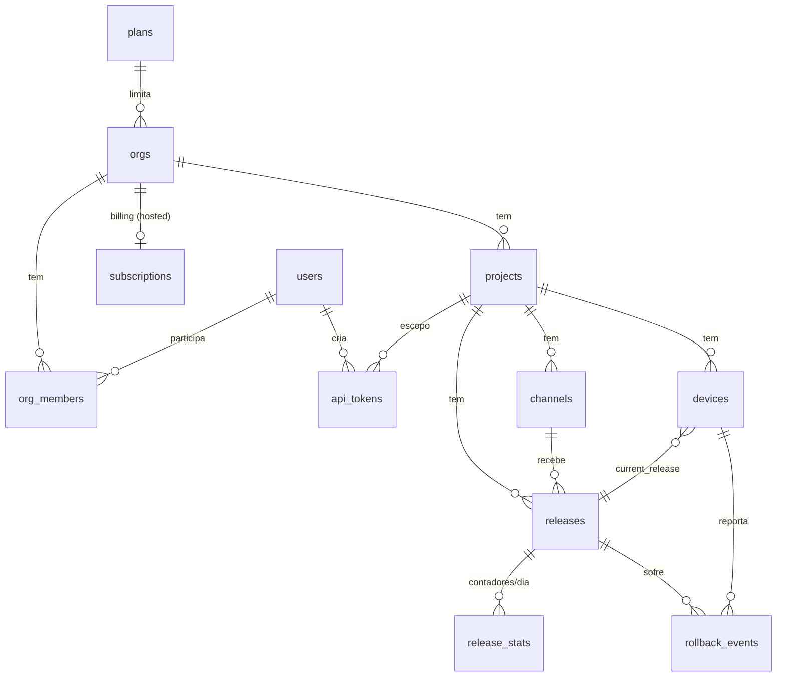

# Modelo de dados

## 1. Visão



Multi-tenant ✅ (hosted): tudo pendura em `orgs`. No self-host (`OTA_MODE=self`), uma org default é criada no primeiro boot — mesmo schema, zero fricção.

## 2. Tabelas

DDL em Postgres, um dialeto só, igual nos três targets (Cloudflare usa Hyperdrive). Declarado uma vez em Drizzle (`apps/server/src/db/schema.ts`) e materializado em migrations versionadas — a suíte de integração roda essas mesmas migrations num Postgres real embarcado (PGlite), então o SQL testado é o SQL que sobe.

```sql
users (
  id uuid PK, email text UNIQUE, password_hash text,
  email_verified_at timestamptz NULL,   -- exigido no hosted antes de criar org
  created_at timestamptz
)

orgs (
  id uuid PK, name text, slug text UNIQUE,
  plan_id text FK DEFAULT 'free',
  trial_ends_at timestamptz NULL,
  created_at timestamptz
)

org_members (
  org_id uuid FK, user_id uuid FK,
  role text CHECK (role IN ('owner','admin','member')),
  PRIMARY KEY (org_id, user_id)
)

plans (
  id text PK,                   -- free | pro | scale (seed)
  max_projects int, max_active_devices int, max_storage_gb int,
  price_month_cents int, stripe_price_id text NULL
)

-- Espelho do Stripe (só OTA_MODE=hosted)
subscriptions (
  org_id uuid PK FK,
  stripe_customer_id text, stripe_subscription_id text,
  status text,                  -- trialing | active | past_due | canceled
  current_period_end timestamptz,
  updated_at timestamptz
)
-- Webhooks processados com idempotência: stripe_events(id text PK, processed_at)
-- Enforcement: quota checada no publish + job diário (devices ativos/30d por org =
-- count em devices, storage = sum(releases.size)). Acima do limite: bloqueia publish
-- novo; NUNCA corta update-check/download de app em produção.

projects (
  id uuid PK,
  org_id uuid FK,
  name text, slug text UNIQUE,
  app_key text UNIQUE,          -- pública, embutida no app, identifica o projeto no Device API
  public_key text,              -- RSA pública (vai p/ o binário via config plugin)
  private_key_enc bytea,        -- RSA privada, AES-256-GCM com OTA_MASTER_KEY
  created_at timestamptz
)
-- App ≡ Project ✅ (validado 2026-09-01): um produto = um projeto; plataforma é coluna da release/device.
-- Entidade App separada (estilo CodePush: MyApp-iOS, MyApp-Android) só adicionaria um join
-- em toda query. Se um dia houver white-label multi-app por produto, adiciona-se orgs acima.

channels (
  id uuid PK, project_id uuid FK, name text,
  UNIQUE (project_id, name)
)   -- seed: development, staging, production

api_tokens (
  id uuid PK, user_id uuid FK, org_id uuid FK,
  project_id uuid NULL FK,      -- NULL = todos os projetos da org
  name text, token_hash text UNIQUE,   -- token opaco "ota_..." mostrado uma vez
  scopes text[] DEFAULT '{admin}',     -- {read} p/ tokens de observabilidade
  kind text DEFAULT 'manual',   -- manual | oauth (emitido pelo fluxo MCP; + refresh_token_hash, expires_at)
  last_used_at timestamptz, created_at timestamptz
)

releases (
  id uuid PK,                   -- UUIDv7: ordenação temporal está no próprio id
  project_id uuid FK, channel_id uuid FK,
  platform text CHECK (platform IN ('ios','android')),
  label int,                    -- "v42" — sequência por (project, channel, platform)
  group_id uuid,                -- agrupa ios+android do mesmo `ota publish`
  runtime_version text,         -- fingerprint (ou valor semver na estratégia futura)
  status text DEFAULT 'active' CHECK (status IN ('active','paused','disabled')),
  mandatory bool DEFAULT false,
  rollout_percent smallint DEFAULT 100,
  storage_key text, size bigint,
  sha256 text, signature text,  -- assinatura do manifest canônico (API §4.2)
  message text, git_commit text,
  created_by uuid FK, created_at timestamptz,
  UNIQUE (project_id, channel_id, platform, label)
)
-- índice do update-check:
CREATE INDEX ON releases (project_id, channel_id, platform, runtime_version, status);

devices (
  id uuid PK,                   -- gerado NO device, anônimo, sem PII
  project_id uuid FK,
  platform text, channel text,
  native_version text,          -- ex: "1.4.2"
  runtime_version text,         -- fingerprint do binário instalado
  current_release_id uuid NULL, -- NULL = rodando bundle embarcado
  preview_release_id uuid NULL, -- setado quando pinned via QR
  first_seen_at timestamptz, last_seen_at timestamptz
)
CREATE INDEX ON devices (project_id, last_seen_at DESC);
CREATE INDEX ON devices (project_id, current_release_id);
CREATE INDEX ON devices (project_id, native_version);

-- Contadores agregados por release e dia — o coração da telemetria barata
release_stats (
  release_id uuid FK, day date,
  downloads int DEFAULT 0, installs int DEFAULT 0,
  ready int DEFAULT 0,          -- primeiro launch ok (sucesso)
  failed int DEFAULT 0,         -- verify_failed + crash antes do ready
  rollbacks int DEFAULT 0,
  PRIMARY KEY (release_id, day)
)

-- Único evento guardado cru: raro e valioso p/ debug
rollback_events (
  id bigint GENERATED ALWAYS AS IDENTITY PK,
  project_id uuid, release_id uuid, from_release_id uuid NULL,
  device_id uuid, reason text CHECK (reason IN ('crash','verify_failed','server','manual')),
  meta jsonb,                   -- versão nativa, plataforma, msg de erro se houver
  created_at timestamptz
)

audit_log ( ... )               -- v2: quem publicou/pausou/promoveu o quê
```

## 3. Mapeamento das entidades pedidas

| Entidade pedida | Onde vive | Nota |
|---|---|---|
| Project | `projects` | |
| App | `projects` (fundido) ✅ | ver comentário no DDL |
| Platform | coluna em `releases`/`devices` | enum, não tabela |
| Channel | `channels` | |
| Native Version | `devices.native_version` + `runtime_version` | distribuição por versão nativa = GROUP BY; sem tabela própria |
| Release | `releases` | |
| Deployment | relação release×channel | `promote` **copia** a release p/ o canal destino (nova linha, novo id/label, mesmo bundle/sha256/group). Histórico por canal fica completo e imutável |
| Installation / Device | `devices` | 1 linha por instalação |
| Update Attempt | `release_stats` (contadores) + `failed[]` no protocolo | tentativas cruas por device = v2, se precisar |
| Rollback | `rollback_events` + contador | |
| Session | **derivada** de `last_seen_at` | tabela de sessões = 1 linha por abertura = exatamente o custo que queremos evitar. "Ativo" = visto na janela (§4) |

## 4. Telemetria barata (requisito 12)

**Princípio: o custo é O(devices) + O(releases×dias), nunca O(eventos).**

1. **O update-check é o heartbeat.** Todo launch/foreground já chama `/update-check` com `deviceId`, release atual e versão nativa. Nenhuma request extra para "medir ativos".
2. **1 linha por device (upsert com throttle).** Só escreve se `last_seen_at` > 1h atrás **ou** algo mudou (release/nativa/canal). 100k devices ⇒ ~100k–500k updates/dia ≈ dezenas/s no pico. 1M devices = 1M linhas — banal para Postgres.
3. **Funil por contadores diários.** Eventos do SDK viram `UPSERT ... SET x = x + 1` em `release_stats`:

```sql
INSERT INTO release_stats (release_id, day, ready) VALUES ($1, current_date, 1)
ON CONFLICT (release_id, day) DO UPDATE SET ready = release_stats.ready + 1;
```

   Batch de eventos = uma transação. Série diária dá o gráfico de adoção ao longo do tempo de graça (releases × dias ativos ≈ centenas de linhas).
4. **Não guardamos eventos crus** — exceto `rollback_events` (baixo volume, alto valor de debug). Trade-off honesto: sem replay de funil por device, sem coortes exóticas. Quando (se) precisar: ClickHouse ao lado consumindo os mesmos eventos, sem tocar o caminho quente.

**Definição de "usuário ativo"** (explícita no dashboard): device com `last_seen_at` na janela (default 30d, configurável). Distribuição ao vivo:

```sql
-- Tabela do dashboard: "Versão OTA | Usuários | % da base | Instalações | Rollbacks"
SELECT r.label, count(d.id) AS usuarios,
       round(100.0 * count(d.id) / sum(count(d.id)) OVER (), 1) AS pct_base
FROM devices d LEFT JOIN releases r ON r.id = d.current_release_id
WHERE d.project_id = $1 AND d.platform = $2
  AND d.last_seen_at > now() - interval '30 days'
GROUP BY r.label ORDER BY usuarios DESC;
-- + installs/rollbacks somados de release_stats por release

-- Distribuição por versão NATIVA (fragmentação do binário):
SELECT native_version, platform, count(*) FROM devices
WHERE project_id = $1 AND last_seen_at > now() - interval '30 days'
GROUP BY 1, 2 ORDER BY 3 DESC;

-- Saúde de uma release:
SELECT sum(ready) AS ok, sum(failed) AS falhas, sum(rollbacks) AS rb,
       round(100.0 * sum(rollbacks) / nullif(sum(installs),0), 2) AS taxa_rollback
FROM release_stats WHERE release_id = $1;
```

Precisão: contadores são *pelo menos uma vez* (retry do SDK pode duplicar raramente) — suficiente para operação; o CodePush vivia disso. Contagem de devices é exata.

## 5. Retenção e limpeza

| Dado | Retenção |
|---|---|
| `devices` | prune `last_seen_at` > 180d (job diário) |
| `release_stats` | para sempre (minúsculo) |
| `rollback_events` | 90d |
| bundles no storage | imutáveis; GC de releases `disabled` antigas = v2 |
